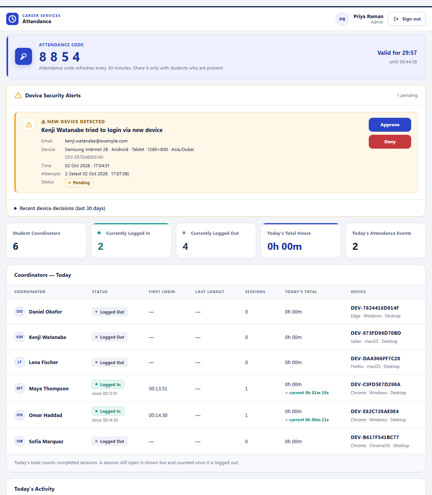
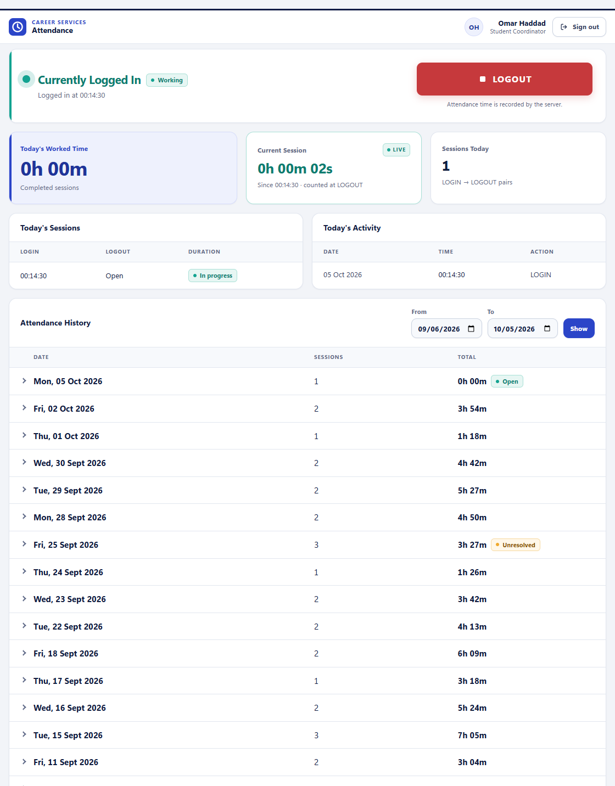
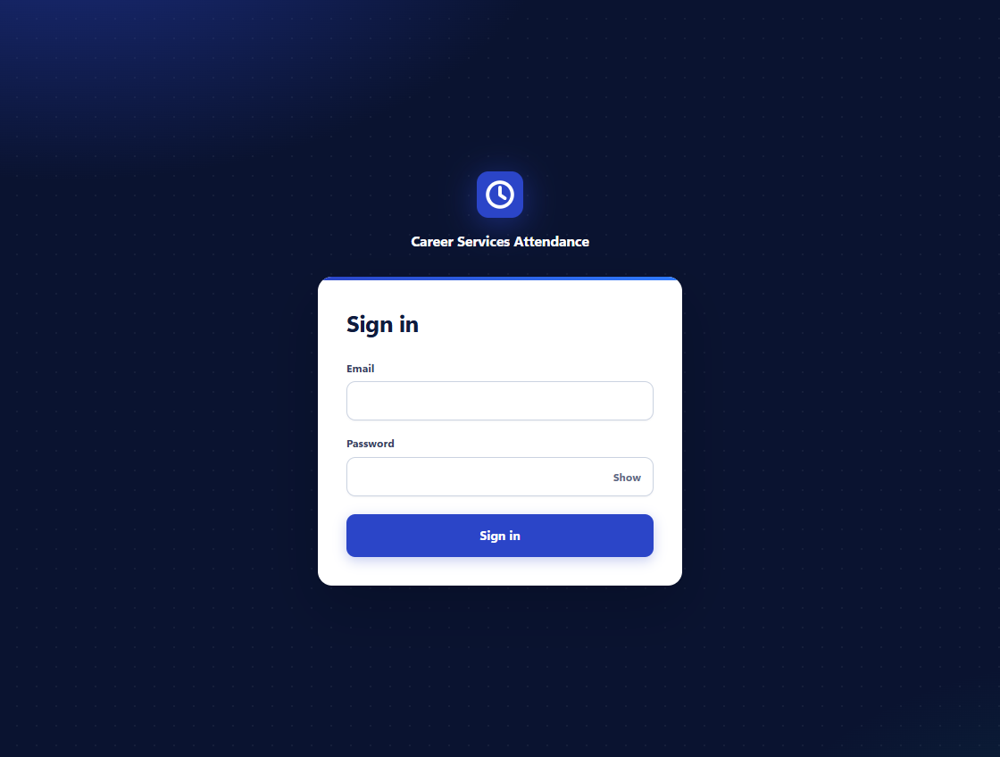
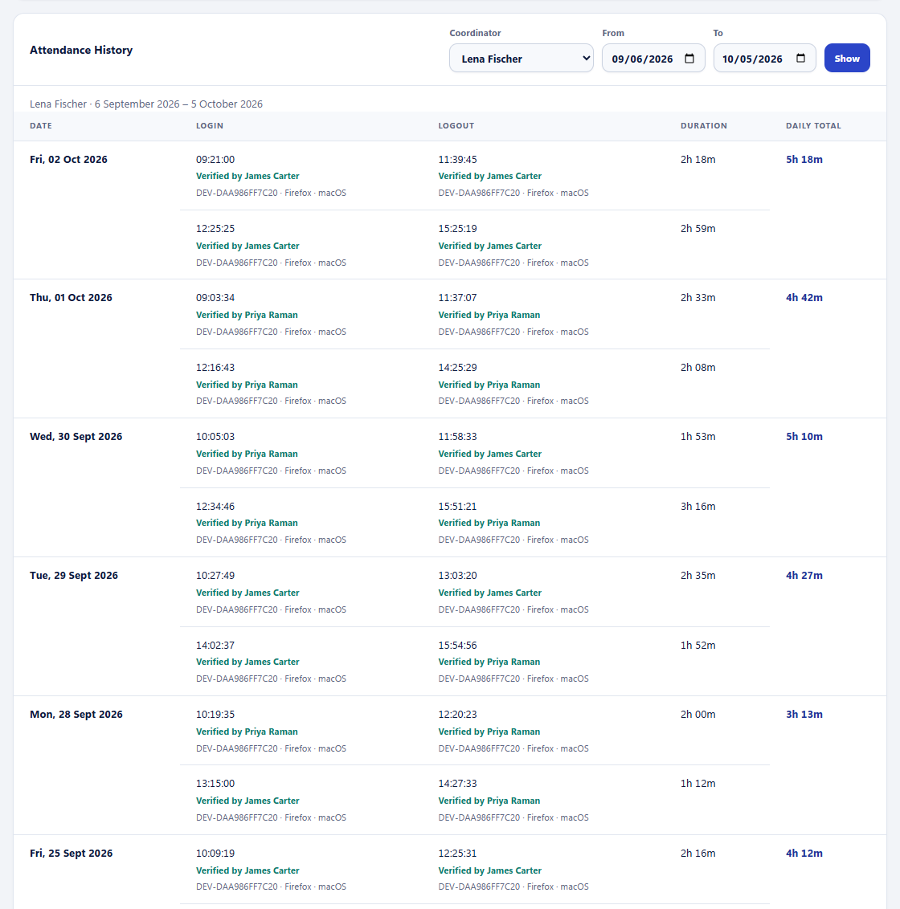
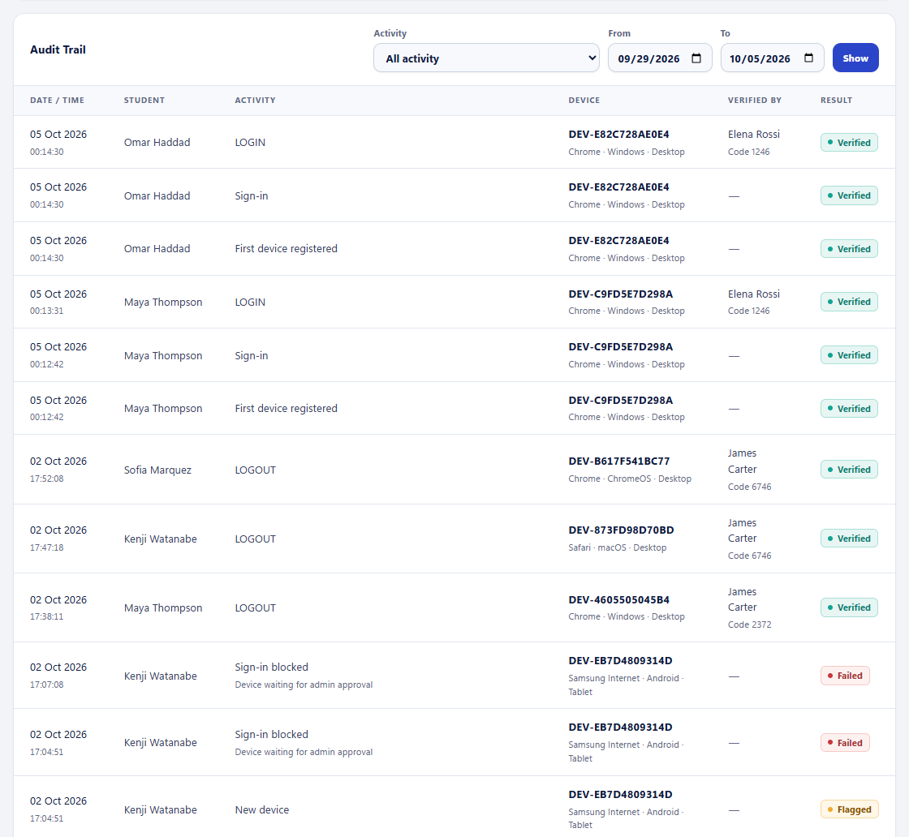
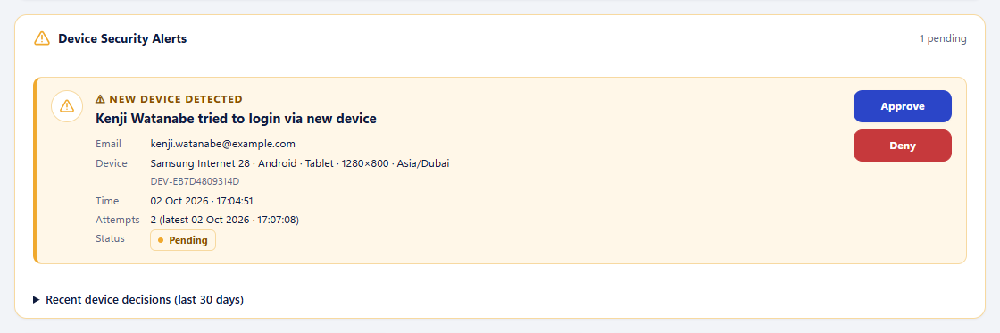
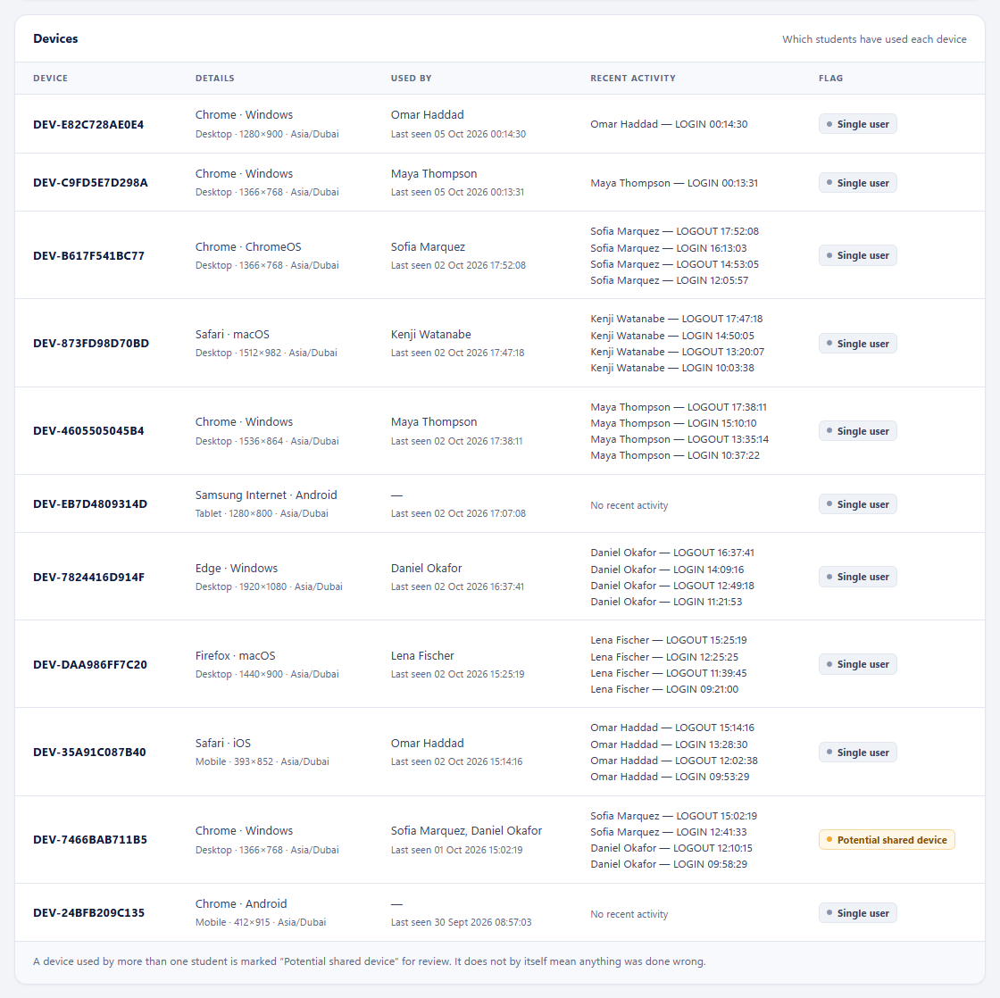

# Career Services Attendance System — Demo

Attendance and working-time tracking for **student coordinators** in a university
career services office. A coordinator signs in, presses **LOGIN** when they start
working and **LOGOUT** when they stop; an admin's rotating 4-digit code confirms
each action. The server records exact timestamps, pairs every LOGIN with its
LOGOUT and adds up the time worked each day. Admins see everyone's attendance,
devices and a tamper-resistant audit trail. Coordinators see only their own.

> **About this repository.** This is the public, sanitized edition of a system
> that is in production use. The production repository, its history, its data and
> its infrastructure are private and are not part of this repository. All people,
> email addresses, devices, IP addresses and attendance records here are
> **synthetic**. The application code, database schema and test suites are the
> real ones. This repository's commit history records how this public edition was
> prepared, not the original development history.



---

## Contents

- [Problem](#problem) · [Solution](#solution) · [Key features](#key-features) · [Technology](#technology-stack)
- [Run the demo locally](#run-the-demo-locally) · [Demo credentials](#demo-credentials) · [Screenshots](#screenshots)
- [Architecture](#architecture) · [Attendance logic](#attendance-logic) · [Attendance verification](#attendance-verification)
- [Database schema](#database-schema) · [Security](#authentication--security) · [API](#api) · [Tests](#tests)
- [Demo data](#demo-data) · [Security & privacy of this repository](#security--privacy-of-this-repository) · [Deploying your own demo](#deploying-your-own-demo) · [Limitations](#limitations) · [License](#license)

## Problem

Student coordinators work flexible hours in short shifts. The office needs to know
how many hours each coordinator actually worked, based on records that:

- cannot be edited from the client (no client clocks, no client-supplied user IDs);
- can only be made by someone **who is present**, not remotely or from a shared account;
- show who verified each action, and what was attempted but refused;
- cost nothing to run: no paid hosting, no always-on database.

## Solution

A single Cloudflare Worker serves a plain HTML/CSS/JS frontend and a small JSON
API. The data lives in Neon serverless PostgreSQL. Most of the correctness rules
are enforced by the database itself:

- **Database-enforced attendance sequence.** LOGIN and LOGOUT must alternate. A
  duplicate LOGIN or a LOGOUT without a LOGIN cannot be stored, however fast or
  often the client sends it.
- **Proof of presence.** Every LOGIN/LOGOUT needs the current code of a signed-in
  admin. Codes are random, unique and rotate every 30 minutes.
- **Device approval.** A student may sign in only from devices an admin has
  approved. The first device is approved automatically; any new one becomes a
  request for an admin.
- **Append-only audit trail.** Database triggers reject UPDATE, DELETE and TRUNCATE.
- **Free tier by design.** No cron, queues, KV or polling. The database is queried
  only when someone uses the app, so Neon can scale to zero.

## Key features

| Area | What the code does |
| --- | --- |
| Authentication | Email + password; bcrypt hashing and verification inside PostgreSQL (`pgcrypto`); server-side sessions; `HttpOnly; Secure; SameSite=Strict` cookies; timing-safe handling of unknown emails; failed sign-in throttling (per email and per IP) |
| Role-based access | `student` and `admin` roles read from the database on every request; students only ever see their own data; `/api/admin/*` returns 403 to students |
| Attendance tracking | Server timestamps; race-safe recording (5 simultaneous LOGINs → exactly 1 succeeds); session pairing; daily totals that exclude breaks; overnight sessions flagged *Unresolved* rather than guessed |
| Attendance verification | Per-admin 4-digit codes from a CSPRNG, rotating every 30 minutes; incorrect-code limits (per 15 min, per IP, per 24 h); the verifying admin is recorded separately for LOGIN and LOGOUT |
| Devices | Application-issued device key (no fingerprinting); browser/OS/screen metadata; device approval workflow (approve/deny); shared-device detection |
| Admin dashboard | Live overview, the admin's code with a countdown, device security alerts, per-coordinator history with devices and verifying admins, device list, filterable audit trail |
| Coordinator dashboard | Status, live session timer, today's sessions and total, history by day |
| Zero-downtime migrations | The Worker detects which migrations are applied and runs at the level the database supports, so code can be deployed before a migration |
| Security hardening | Strict Content-Security-Policy, `nosniff`/`DENY` headers, same-origin checks on every POST, parameterised SQL everywhere, generic error messages, no secrets in logs |
| Automated testing | 8 suites / 323 checks run the real Worker against an in-memory PostgreSQL. CI runs the tests, a type check, a build and a public-safety scan |

## Technology stack

| Layer | Technology |
| --- | --- |
| Runtime / hosting | Cloudflare Workers (Free plan), static assets served by the same Worker |
| Backend | TypeScript, no framework (a ~50-line router) |
| Database | PostgreSQL on Neon (serverless), `@neondatabase/serverless` HTTP driver, `pgcrypto` |
| Frontend | Plain HTML, CSS and JavaScript; no build step, no external scripts or fonts |
| Tooling | Wrangler, esbuild, TypeScript (`strict`), Node.js 22 |
| Tests and local demo | PGlite (PostgreSQL compiled to WebAssembly, in-memory) |
| CI | GitHub Actions: type check, tests, build and public-safety scan; no deployment |

## Run the demo locally

Requires **Node.js 22+**. No database, account or configuration needed:

```bash
git clone https://github.com/BharatGupta09/career-services-attendance-demo.git
cd career-services-attendance-demo
npm ci
npm run demo
```

Open **<http://localhost:8787>** in Chrome or another Chromium-based browser.
Use `localhost` rather than `127.0.0.1`, because the session cookies are
`Secure` and browsers allow those on `localhost`.

`npm run demo` bundles the real Worker, starts an in-memory PostgreSQL, applies
the migrations, loads the synthetic dataset and serves the app. Nothing leaves
your machine, and the data resets when you stop it.

### Demo credentials

Every demo account uses the password **`DemoPassword123!`**. These accounts exist
only in the demo database and are fictional.

| Role | Email | What to try |
| --- | --- | --- |
| Admin | `priya.raman@example.com` | The dashboard, attendance code, device alerts (approve or deny Kenji's tablet), history, devices, audit trail |
| Admin | `james.carter@example.com`, `nadia.hassan@example.com`, `elena.rossi@example.com` | Each admin session has its own code |
| Student | `maya.thompson@example.com` or `omar.haddad@example.com` | Their first sign-in approves your browser, then LOGIN/LOGOUT with an admin's code |
| Student | `kenji.watanabe@example.com`, `lena.fischer@example.com`, … | Device-locked: your browser becomes a **pending request** for an admin |

**Attendance code:** the terminal running `npm run demo` prints a current admin
code (and the next one each time it rotates), so one browser is enough. You can
also sign in as an admin in a second (private) window. Signing out of an admin
session ends its code immediately, by design.

## Screenshots

All screenshots were taken from `npm run demo` and show synthetic data only.

| Coordinator view | Sign in |
| --- | --- |
|  |  |

| Coordinator history (admin) | Audit trail |
| --- | --- |
|  |  |

| Device security alert | Devices and shared-device flag |
| --- | --- |
|  |  |

## Architecture

```
Browser ──HTTPS──▶ Cloudflare Worker ──HTTPS (Neon HTTP driver)──▶ Neon PostgreSQL
                   ├─ static frontend  (public/)
                   └─ JSON API         (/api/*, src/)

npm run demo / npm test:
Node http server ──▶ the same Worker bundle ──▶ PGlite (in-memory PostgreSQL)
```

| Concern | Choice |
| --- | --- |
| Hosting | One Cloudflare Worker (Workers **Free**) serving static assets + API |
| Database | Neon PostgreSQL (**Free**), reached over HTTP: no pool, no persistent connection |
| Backend | TypeScript, no framework (small router in `src/index.ts`) |
| Frontend | Plain HTML/CSS/JS in `public/`, no build step, no external scripts or fonts |
| Auth | Server-side sessions in PostgreSQL, HttpOnly cookie; bcrypt via `pgcrypto` |

There are no background jobs of any kind. Housekeeping (expired sessions, old
failed sign-ins, code rotation) happens on demand inside normal requests.

### Repository layout

```
src/
  index.ts            router + error handling
  auth.ts             sign-in/out, session validation, requireUser() middleware
  attendance.ts       LOGIN/LOGOUT recording (code-verified), session pairing, daily totals, student API
  admin.ts            admin API (overview, per-coordinator history, audit trail, devices)
  device.ts           application-issued device key + browser-reported device metadata
  device-approval.ts  student sign-in locked to admin-approved devices
  verification.ts     admin attendance codes (30-minute rotation); detects which migrations are applied
  db.ts, http.ts, time.ts, types.ts
public/               index.html, app.js, styles.css, _headers (CSP), favicon.svg
migrations/           001–007 (schema, auth, user directory, devices/codes/audit, rotation, device approval)
scripts/
  demo.mjs            zero-setup local demo (in-memory database + synthetic data)
  seed-demo.mjs       load the synthetic dataset into a demo database (guarded)
  migrate.mjs, set-credentials.mjs, validate.mjs (guarded, demo databases only)
  check-public-safety.mjs   scans the repository for secrets and data that must not be public
  lib/demo-data.mjs   the synthetic dataset generator
  lib/demo-guard.mjs  the demo-only safety barrier
tests/                npm test: the Worker + in-memory PostgreSQL (PGlite) suites
docs/DEPLOYMENT.md    deploying your own demo instance
```

## Attendance logic

- **Server timestamps.** `event_timestamp` defaults to PostgreSQL `now()`. The
  browser's clock is never used.
- **Valid sequences only.** Each user's events carry `seq = 0, 1, 2, …`. A CHECK
  constraint requires LOGIN on even and LOGOUT on odd numbers, and
  `UNIQUE (user_id, seq)` makes each number usable once. LOGIN → LOGIN, or a
  LOGOUT without a LOGIN, **cannot be stored**.
- **Race-safe.** Recording is a single `INSERT … SELECT … ON CONFLICT DO NOTHING`
  that computes the next `seq`. Two simultaneous LOGINs compute the same `seq` and
  exactly one is inserted. The other gets *"You are already logged in."*
- **Pairing and totals.** The LOGIN at `seq = n` pairs with the LOGOUT at `seq = n+1`.
  A day's total is the **sum of its completed sessions**, never "last logout minus
  first login", so breaks are not counted:

  ```
  LOGIN 10:00:00 → LOGOUT 12:30:00   2h 30m
  LOGIN 16:00:00 → LOGOUT 17:00:00   1h 00m
                                     ──────
  Total                              3h 30m
  ```

- **Open and overnight sessions.** An open session shows a live timer and counts
  once it is logged out. A session belongs to the business day of its LOGIN. If it
  is still open after that day ends, or its LOGOUT falls on a later day, it is
  flagged **Unresolved** and not counted. No logout time is ever invented.
- **Timezone.** Timestamps are `timestamptz`. The business day is a fixed IANA
  timezone (`Asia/Dubai` in this code). `attendance_events.event_date` is a
  generated column, so the database itself decides which day an event belongs to.

## Attendance verification

- **Codes.** Each admin session gets its own random 4-digit code
  (`crypto.getRandomValues` with rejection sampling), shown on the admin
  dashboard. Live codes are unique, so a code identifies exactly one admin session.
- **30-minute rotation.** A code is valid for 30 minutes from generation and never
  beyond its admin session. When the countdown ends, the dashboard's next request
  generates a new code that **overwrites the old one**. No scheduled job is
  involved, and the database clock decides validity.
- **Nothing kept for unused codes.** Generating or rotating a code writes nothing
  permanent. Sign-out deletes the session row, so its code stops working at once.
- **Verification** happens in the same transaction that records the event,
  serialised per student. A wrong code records only an audited failed attempt; the
  student never learns whose code it was. Incorrect codes are limited to 5 per
  student and 30 per IP per 15 minutes, and 12 per student per 24 hours.
- **What is kept when a code is used.** Each event stores its device and verifying
  admin, separately for LOGIN and LOGOUT. The audit row also stores the code used
  and the start of its window. A database CHECK makes it impossible to store an
  incorrect code.
- **Devices** are identified by a random `DEV-xxxxxxxxxxxx` key in an HttpOnly
  cookie, plus what the browser reports. There are no hardware identifiers and no
  cross-site fingerprinting.
- **Device approval.** A student may sign in only from an approved device. The
  first device is approved automatically, and any other is refused with *"New
  Device detected - contact admin"* until an admin approves it. A unique index
  allows only one automatic approval per student, so two simultaneous first
  sign-ins cannot both succeed.
- **Shared devices.** If another student used the same device within 2 hours, the
  event is flagged for review with a neutral note. Nobody is blocked.

## Database schema

| Table | Purpose and key rules |
| --- | --- |
| `users` | `full_name`, unique lower-case `email`, nullable bcrypt `password_hash`, `role` (`student`/`admin`), `is_active` |
| `attendance_events` | `seq`/`event_type` alternation CHECK + `UNIQUE (user_id, seq)`; generated `event_date`; `device_id`, `verified_by` |
| `sessions` | SHA-256 of the session token (never the token), expiry, the admin's current `attendance_code` + issue time, the device a student session is bound to |
| `login_failures` | Failed sign-ins in the last 15 minutes throttle further attempts |
| `devices`, `user_devices` | Device metadata; which student used/requested which device, with approval status, deciding admin and attempts |
| `audit_log` | Append-only (triggers reject UPDATE/DELETE/TRUNCATE); a code stored only on successful LOGIN/LOGOUT rows (CHECK) |
| `schema_migrations` | Applied migration versions |

Indexes follow the queries. See `migrations/` for every constraint and index, with comments.

## Authentication & security

- **Passwords**: bcrypt through PostgreSQL `pgcrypto`, verified with
  `crypt(input, hash) = hash` inside the database. The Worker never hashes or
  reads a hash, which keeps it within the Free plan's CPU limit. Unknown emails
  are compared against a dummy hash, so response times don't reveal which emails exist.
- **Sessions**: a 256-bit random token in a `__Host-` cookie
  (`HttpOnly; Secure; SameSite=Strict`). Only its SHA-256 is stored.
- **Authorisation**: `requireUser()` resolves the user from the cookie on every
  request. Student endpoints always query with the session's own user ID; any
  user ID in the URL or body is ignored.
- **Brute force**: 5 failed sign-ins per email (30 per IP) per 15 minutes, stored
  in PostgreSQL, with no paid rate limiting.
- **CSRF**: `SameSite=Strict`, plus POSTs from another origin
  (`Origin`/`Sec-Fetch-Site`) are rejected.
- **Other**: parameterised SQL (tagged templates → bound parameters), input
  validation, generic errors, only error messages logged, strict CSP and framing
  headers, and the UI inserts text only with `textContent`.

## API

All responses are JSON: `{ "success": true, … }` or `{ "success": false, "error": "…" }`.

| Method & path | Who | Purpose |
| --- | --- | --- |
| `POST /api/auth/login` | anyone | `{ email, password, device }` → session cookie |
| `POST /api/auth/logout` | signed in | ends the app session (not attendance) |
| `GET /api/auth/me` | signed in | current user |
| `GET /api/attendance/today` | student | status, today's sessions, events, total |
| `GET /api/attendance/history?from=&to=` | student | own daily history (default last 30 days) |
| `POST /api/attendance/login` · `/logout` | student | `{ code, device }` → record LOGIN / LOGOUT |
| `GET /api/admin/attendance` | admin | today's overview, plus this admin's current code |
| `GET /api/admin/code` | admin | this admin's code (issues the next one when its 30 minutes are over) |
| `GET /api/admin/attendance/:userId?from=&to=` | admin | one coordinator's history with devices and verifying admins |
| `GET /api/admin/audit?action=&from=&to=` | admin | audit trail (default last 7 days) |
| `GET /api/admin/devices` | admin | devices, who used them, shared-device flags |
| `GET /api/admin/device-requests` | admin | pending device requests and recent decisions |
| `POST /api/admin/device-requests/decision` | admin | `{ userId, deviceId, decision: approve\|deny }` |

## Tests

```bash
npm test            # 8 suites, 323 checks (no database or network needed)
npm run typecheck   # tsc --noEmit, strict
npm run build       # wrangler deploy --dry-run: bundles the Worker, deploys nothing
npm run check:public
```

`npm test` bundles the real Worker (with the Neon driver swapped for an in-memory
PGlite shim) and runs: the core regression suite (auth, isolation, attendance,
concurrency, overnight sessions, constraints); verification (codes, devices,
audit, throttling); 30-minute rotation; device approval (including races and
tampering); access revocation; two suites for databases without the newest
migrations; and the demo dataset and its safety barrier.

## Demo data

**This public repository uses synthetic data only and is completely separate
from the production system.**

- The ten users (six coordinators, four admins) are fictional. Their addresses use
  the reserved `example.com` domain, and migrations create them **without
  passwords**.
- `scripts/lib/demo-data.mjs` generates four weeks of attendance relative to the
  current date: one to three sessions on most weekdays, verified by rotating admin
  codes. It also creates an overnight *Unresolved* session, a shared lab computer
  flag, first-device registrations, an approved, a denied and a pending device
  request, and a few incorrect codes. Generation is deterministic apart from the date.
- IP addresses are from the documentation range `203.0.113.0/24` (RFC 5737).

## Security & privacy of this repository

Production credentials, user records, attendance records, database credentials
and private infrastructure details are **intentionally excluded** from this
repository. Specifically:

- No real names, email addresses, attendance, devices, logs or screenshots of the
  production system. The original user guide is not included.
- No connection strings, passwords, API tokens or keys. `DATABASE_URL` exists
  only as a Worker secret that you set yourself, and `.env`/`.dev.vars` files are git-ignored.
- No production URLs, account IDs or project identifiers. The Worker name is
  `career-services-attendance-demo`, so a deployment from this repository cannot
  replace another Worker in the same account.
- **Nothing deploys automatically.** CI only type-checks, tests, builds (dry run)
  and scans.
- **Demo-only safety barrier** (`scripts/lib/demo-guard.mjs`). Every database
  script needs `DEMO_MODE=true` and reads `DEMO_DATABASE_URL`, never
  `DATABASE_URL`. It also refuses any database that holds an account outside the
  demo directory. Seeding additionally requires an empty, freshly migrated database.
- `npm run check:public` (run in CI) scans every tracked file for credentials,
  private keys, tokens, connection strings, non-example email addresses,
  non-documentation IP addresses and files that must not be published.

## Deploying your own demo

Optional: see **[docs/DEPLOYMENT.md](docs/DEPLOYMENT.md)** to run the demo on your
own Cloudflare Workers Free and Neon Free accounts, with a new database created
for the demo.

## Limitations

- A session that crosses midnight is flagged Unresolved and not counted; there is
  no admin correction tool.
- No self-service password reset, user-management screen, exports or
  notifications. Users are managed with the scripts and SQL.
- Dashboards refresh on load or with the Refresh button (by design, no polling).
- A 4-digit code is short by design. Guessing is limited and audited, but a code
  should be shared only with students who are present.
- A device key identifies a browser, not a person: clearing site data gives a new
  key. Shared-device flags are a prompt for review, not proof.
- Audit entries are permanent, even if the events they refer to are deleted.

## License

[MIT](LICENSE). The license covers the code and documentation in this repository; all data in it is synthetic.
